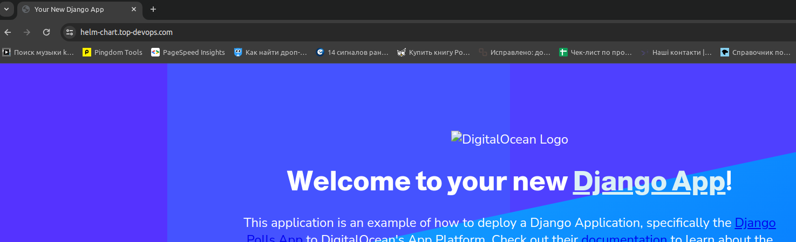
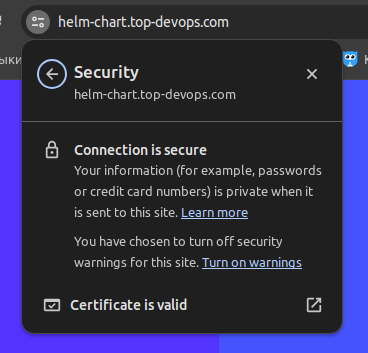

# Installation of all necessary infrastructure
In order to install everything you need to install Django using Helm Chart, you need to go to the infra folder and run the following commands.
```
terraform init
terraform apply
```
Before execution, you need to change all the changes to your own in the variables.tf file.

## After the terraform is completed, the following resources will be created:
1. Installation VPC 
2. Creating k8s cluster
3. Creating PostgreSQL
4. Installation and configuration AWS Load Balancer Controller
5. Create a IAM role and ServiceAccount


## Create Certificate
To create a certificate in AWS, I used AWS Certificate Manager (ACM). I created a request and then used CNAME to confirm the ownership of the domain.

### Deploying django-app Helm Chart
In the values.yaml file, change the variables to your own and add db_host postgresql.
To launch the Helm chart, go to the helmfile folder and run the following command:
```
helmfile apply
```
## Configuration domain name records
After the load balancer is automatically created for our application, you should add its dns to the domain name settings.
To do this, I go to route 53 and create a new A record where in the Alias section I add the dns of the load balancer.
## Checking the success of the execution
After the record was successfully applied, I went to the browser and saw that my domain was successfully working with an ssl certificate.

The connection is secure and certificate is valid.
